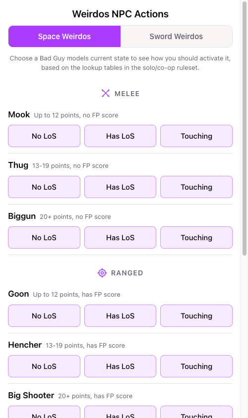
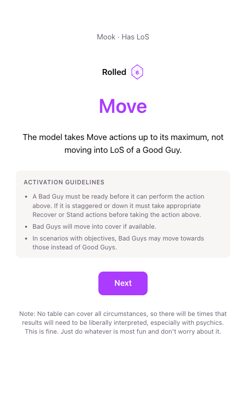

A simple action generator for NPC characters in the miniature skirmish wargames Space Weirdos and Sword weirdos (solo/co-op games).

Pick an npc character type, click their current state (Line of Sight or not, or touching one of your units). 
The app will then perform the random d20 lookup from the relevant action table and tell you how you should activate that unit.

Mobile-friendly so you can run it on a phone screen during the game.

Available publicly at [thomanil.github.io/space-sword-weirdos-npc-actions](https://thomanil.github.io/space-sword-weirdos-npc-actions/).

| Unit list | Lookup result |
| --- | --- |
|  |  |

## Running locally

Requires [Node.js](https://nodejs.org/) (v18+) and npm.

```bash
npm install
npm run dev
```

Then open the printed `http://localhost:...` URL in your browser (or on your phone, using your computer's local network address instead of `localhost`).

Other commands:

- `npm run build` — build a production bundle into `dist/`
- `npm run preview` — locally preview the production build

## Credits

Space / Sword Weirdos is a game system created and owned by Garske Games. Support them by buying the game: [wargamevault.com/en/publisher/7692/garske-games](https://www.wargamevault.com/en/publisher/7692/garske-games).

## License

This project's code is licensed under the [MIT License](LICENSE). The Space Weirdos / Sword Weirdos game rules, terminology, and tables it reproduces remain the property of Garske Games.
